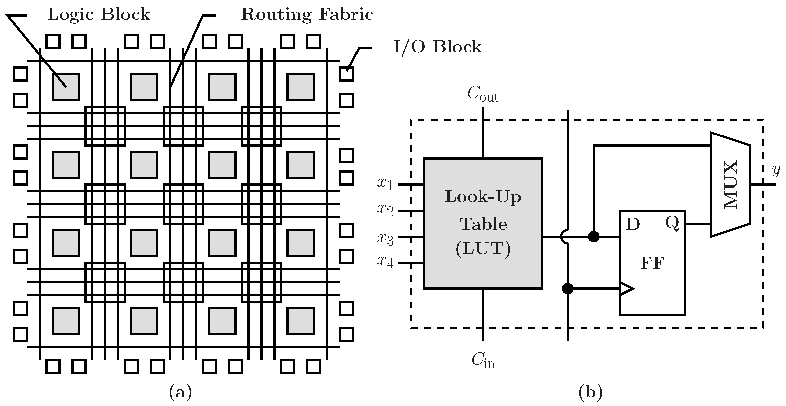
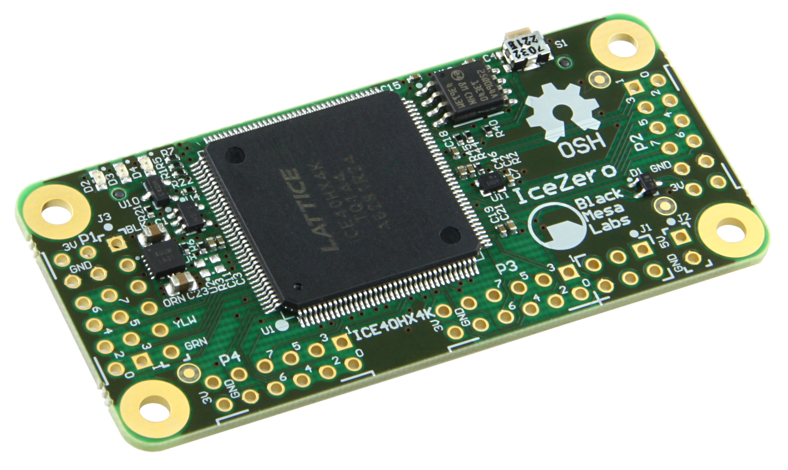
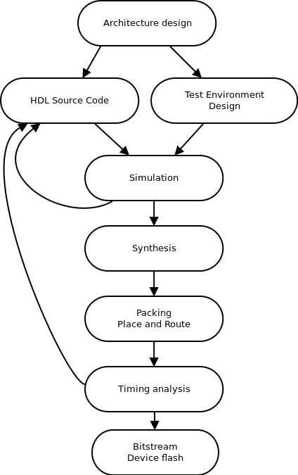
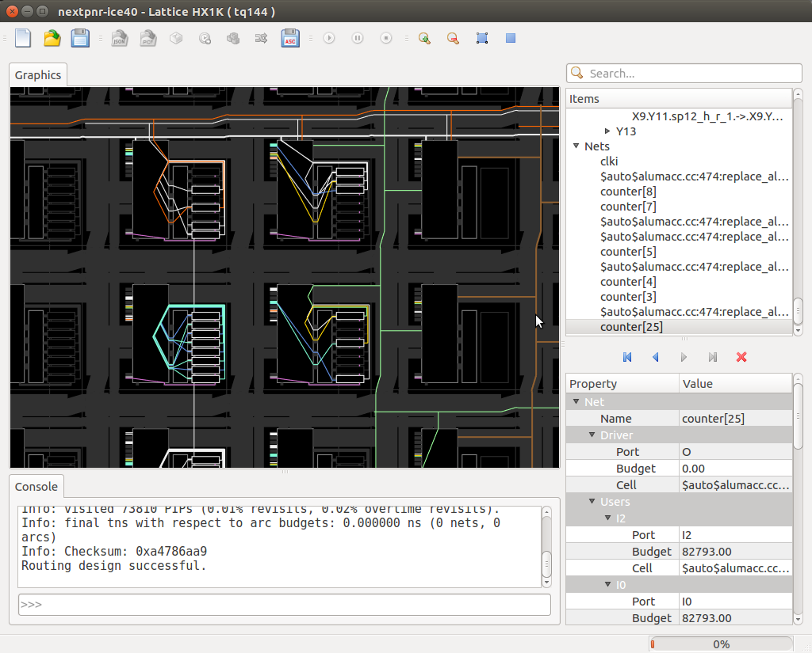

---
title:
- From Verilog to Bitstream
subtitle:
- with free and open source tools
author:
- Rangel Ivanov
theme:
- Copenhagen
date:
- June 8 2019 TuxCon
---

# Agenda

+ What is an FPGA?
+ FPGA flow process
+ Vendor tooling
+ Open source tools
+ Supported devices
+ Demos

# What is an FPGA?

+ Field Programmable Gate Array (FPGA)
+ Integrated curcuit
+ Reconfigurable/programmable digital logic
+ Composed of logic elements and routing fabric
+ A way to create custom hardware
    - HDMI capture
    - Custom CPU
    - Motor controller
+ Parallel in nature
+ Lots of IO
+ Fast and flexible (depending on the device size)
+ "Programmed" using Verilog/VHDL
    - Describe a digital curcuit design using high level constructs

# Simplified FPGA internals



# A small FPGA



# FPGA Flow



# Example blinky verilog code

```verilog
module blink(input clk_25Mhz, output led);
    // 25 000 000 hz / (2 ^ 23 - 1) hz = 1 hz
    reg [23:0] counter = 0;
    reg led_status = 0;

    always @(clk_25Mhz) begin
        counter <= counter + 1;
        // Every 1 Hz MSB toggles
        // MSB is the least changing bit
        led_status = counter[23];
    end

    assign led = led_status;
end module
```


# Vendor Tools

- Every device vendor has it's own tooling
- Device architecture differ from vendor to vendor
- Huge gigabyte downloads
- Close source/propriatary
- No "GCC" equivalent

# Enter Project iCEStorm

- The first fully open source verilog-to-bitstream flow for FPGA's
- Targets Lattice's iCE40 family
    - Small to Medium size FPGA's
    - 4 Input LUT architecture
    - Approx max 7600 Logic elements
    - Relatavely simple architecture
- Released in 2015
- Fully documented bitstream format
- Mostly done by Clifford Wolf
- https://github.com/cliffordwolf/icestorm


# Project iCEStorm

- Yosys - verilog parsing and synthesis
- Arachne PnR - place and route
- IcePack - bitstream generation
- IceProg - FPGA download/programming tool
- IceTime - Timing analysis

# Demo 1

- NES implementation on an iCE40 FPGA
    - Olimex iCE40HX8K FPGA
- VGA output
- SRAM interfacing
- Game loaded from SPI Flash
- My first big experience with FPGA's

# Simulation and verification

- Verilator - https://www.veripool.org/wiki/verilator
- Icarus Verilog - http://iverilog.icarus.com/
- SymbiYosys - https://symbiyosys.readthedocs.io/
    - Formal methods/verification
    - https://zipcpu.com/blog/2017/10/19/formal-intro.html
    - Developed by https://www.symbioticeda.com/

# 2018 - a new beggining for opensource PnR

- Arachne PnR is not timing driven
- Arachne PnR is specific to iCE40
    - We want to add support for new devices
    - We want a PnR tool that abstracts the target archecture

# Enter nextPnR

- Aims to be vendor neutral
- Timing driven
- Algorithm and architecture exploration
- Bigger and faster devices
- https://github.com/YosysHQ/nextpnr

# NextPnR screenshot




# Lattice ECP5 support

- Project Trellis - https://github.com/SymbiFlow/prjtrellis
    - Dave Shah
- Up to 85K logic elements
- High speed DDR
- 2-4 SERDES lines
    - 3 Gbits or 5 Gbits per sec
    - USB 3.0
    - PCI Express
- Max 180 DSP's
- Potential use cases
    - HDMI capture
    - 1G Ethernet adapter
    - Software Defined Radio
    - 4G Base stations
    - ML Accelerator

# Demo 2

- Lattice ECP5-EVN board with SDRAM hat
- 50Mhz RISC-V linux capable SoC
- RV32 with MMU support
- 64MBytes of SDRAM
- VexRiscV - https://github.com/SpinalHDL/VexRiscv
- Kernel and rootfs built using buildroot
- Built using Litex
    - https://github.com/enjoy-digital/linux-on-litex-vexriscv


# Other bitstream documentation efforts

- SymbiFlow - https://symbiflow.github.io/
    - The umbrella project for all FOSS flows
- Xilinx 7 series in progress
- Lattice MachXO2 in progress

# Dev Boards

iCEBreaker FPGA 


# iCEBreaker

- Lattice iCE40 UP5K
    - 5280 logic cells
    - 120 Kbit dual-port block RAM
    - 1 Mbit (128 KByte) single-port RAM
    - PLL, 2 x SPI, 2 x I2C hard IPs
    - Eight DSP multiplier blocks for signal processing
    - 128 mbit SPI flash
    - low power consumption
- Suitable for teaching FPGA's from scratch
- How to buy
    - https://www.crowdsupply.com/1bitsquared/icebreaker-fpga


# Olimex iCE40HX8K-EVB


# Olimex iCE40HX8K-EVB

- The largest and fastest ice40 FPGA
    - iCE40HX8K
    - 7680 Logic cells
    - 128 Kbits (16K byte) embedded block RAM
    - 512 Kbyte SRAM organized as 256Kx16bit 10ns
    - 4 x 40 pin connectors for GPIOs
- [BuyLink](https://olimex.com/Products/FPGA/iCE40/iCE40HX8K-EVB/open-source-hardware)


# Lattice ECP5 dev boards

- Lattice ECP5-EVN board


# Lattice ECP5 evn 

- Lattice ECP5-5G LFE5UM5G-85F-8BG381
- 85K logic elements
- 4 SERDES channels
- 178 General purpose I/Os, 20 differential pair I/Os
- 3744 kbit embedded block ram
- 156 18x18 multipliers
- 4 PLL's


# ULX3S dev board, open source hardware

https://github.com/emard/ulx3s


# Thank You

- https://github.com/YosysHQ/nextpnr
- http://www.clifford.at/yosys/
- https://github.com/SymbiFlow/prjtrellis/
- https://github.com/cliffordwolf/icestorm
- https://github.com/SpinalHDL/VexRiscv
- https://github.com/enjoy-digital/litex
- NextPNR Talk OrConf 2018
    - https://www.youtube.com/watch?v=XbwrOff59ck
- prjtrellis talk fosdem 2019
    - https://ftp.heanet.ie/mirrors/fosdem-video/2019/AW1.125/trellis_and_nextpnr.mp4
